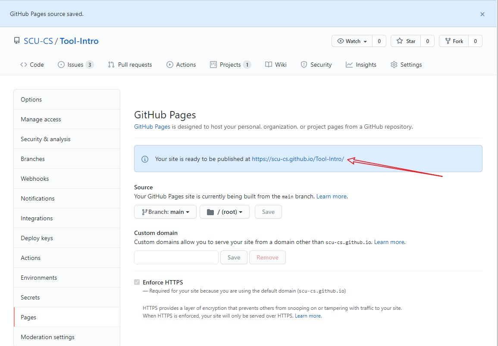

# Docsify的入门到使用

## 安装依赖

### nodejs

参考文章（Windows下安装）：
- <https://www.cnblogs.com/renlywen/p/13522869.html>
- <https://www.cnblogs.com/zhouyu2017/p/6485265.html>
- <https://www.runoob.com/nodejs/nodejs-install-setup.html>

注意事项
- 一定要换源
- 安装选择添加到环境变量（PATH）
- 博客中提到的测试或者顺手安装的东西，不需要就不要装
- 先不要管配置文件

### Docsify

[官方中文文档](https://docsify.js.org/#/zh-cn/quickstart)

> `npm` `docsify` 等工具都是使用的命令行

Windows下的几种命令行
- CMD:Win+R后输入cmd再回车打开
- PowerShell:Win+X+I/A打开

下载：`npm i -g docsify-cli --registry https://registry.npm.taobao.org`

#### 使用

在想用的文件夹使用 `docsify init __FolderYouWant__` 初始化

之后就可以输入 `docsify serve` 指令来预览
- 如果文件夹在当前目录，可以省略命令中的路径
- 如果不在，则需要使用 `docsify serve __ThePathToFolder__`

默认本地服务器在 `http://localhost:3000` （使用浏览器访问）

### Markdown

速览的话，可以看看[我的笔记](https://blog.csdn.net/qq_46264758/article/details/108178418)

慢慢看的话，可以看[菜鸟教程](https://www.runoob.com/markdown/md-tutorial.html)

### Pages

如果自己有服务器的话，就看看 apache 和 Nginx 怎么安装配置吧。这里讲一下 Gitee 和 GitHub 的 Pages 使用。
#### GitHub

打开仓库首页

按图示点击

选择 `main` 或者 `master` 分支（主要看 `index.html` 在什么分支），然后 `Save` 就好了。

保存之后，会显示网页链接。

点击即可查看。
#### Gitee

打开仓库首页

按照图示点击就好

> 不过最近在 **绿色网络环境改造** 不知道什么时候结束 -- 2021.7.15