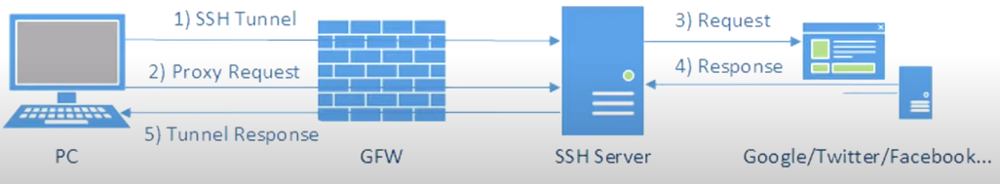
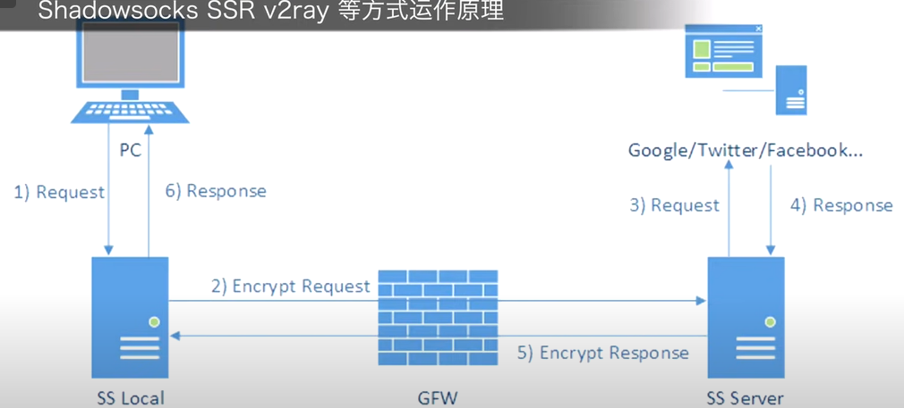

# GFW

>   Great Fire Wall

[机场测速](https://www.duyaoss.com/)

本部分为YouTube[【硬核翻墙系列】](https://www.youtube.com/playlist?list=PLqybz7NWybwUgR-S6m78tfd-lV4sBvGFG)的笔记

需要一点计算机网络的知识

## 封锁方式

-   DNS污染
-   关键字阻断:在明文http协议中封锁关键字
-   端口阻断 阻断一些知名端口 443 22
-   发展中

## 突破方式

### 早期http代理

VPN

用国外正常服务器做中转

1.   明文与国外服务器建立连接
2.   加密实际数据

>   流量特征明显

1.   发送数据包请求和一个服务器建立加密连接
2.   紧跟着代理请求

处理

1.   封锁VPN端口 审核制（白名单）
2.   封VPN Server IP

### Shadowsocks

将proxy server拆分为本地和远端两个 将流量全加密

>   SSR V2ray使用类似的原理

SS Local可以是软路由 也可以是软件等

### VPN

>   Virtual Private Network 虚拟私人网络

端对端加密

避免流量被中间劫持

**数据链路层**

### 多种方式的对比

三种类型

-   软件

    -   VPN

    -   SS

    -   SSR

    -   V2ray

    -   Trojan

    -   >   越新的协议和加密算法更相对安全

    -   很多只能代理应用层流量

-   硬件

    -   接管所有流量
    -   路由器算力低（性能瓶颈）
    -   软路由（改过的路由器）
        -   稳定性问题
        -   维护麻烦

-   网关

    -   软件实现路由功能

VPN$\neq$翻墙

网关模式

| 平台    | 软件  |
| ------- | ----- |
| Windows | clash |
| macOS   | Surge |

## 线路

>   实测最重要

国外御三家

-   GCP：Google Cloud Platform

-   AWS：Amazon Web Service
-   Azure

不推荐当梯子用

### CN2

>   Chinatelecom Next Carrier Network

更好的QoS(Quality of Service)网络

>   游戏加速器使用有QoS的CN2

### BGP

>   Border Gateway Protocol

自动切换线路

### IPLC

>   International Private Lensed Circuit

国际私有租用线路（专线）

-   带宽低
-   流量小（流量倍速高）
-   贵
-   不通过GFW审查

## 协议

### SS

>   主流

### V2ray

采用Vmess和websocket+tls两层加密

相对安全+需要算力比较大

VPS部署难度大

### Trojan

解决V2ray的一些缺点

-   部署难度
-   只用一层TLS加密

Websocket+tls

>   不支持反代理

## 安全问题

科学上网最重要的是**科学**，科学的行为保证自身的安全

教授他人翻墙属于违法行为

