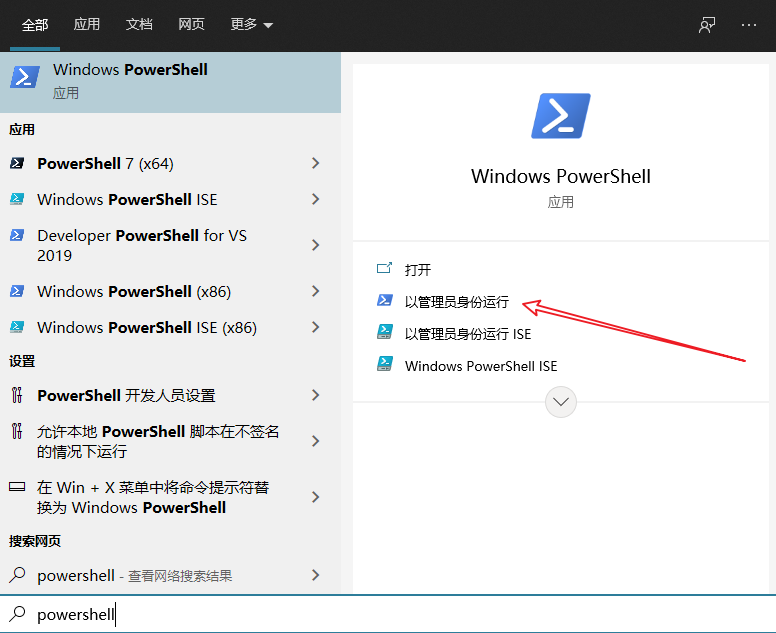

# WSL 安装

基本看 Windows 的官方教程就可以了<https://docs.microsoft.com/zh-cn/windows/wsl/install-win10#step-6---install-your-linux-distribution-of-choice>

## 注意事项

1. 以管理员打开 PowerShell 的方式
   1. 按 `Win` 或 `Win+Q` 后输入 `powershell` 
   2. 按图点击管理员运行
2. 密码的输入没有回显（即输入密码后不会显示输入内容或星号）
3. [换源](https://101.lug.ustc.edu.cn/Ch03/index.html#software-sources)
4. 换源之后
   1. `sudo apt update`
   2. `sudo apt upgrade`
   3. `sudo apt install __the_softwares_you_want -y`